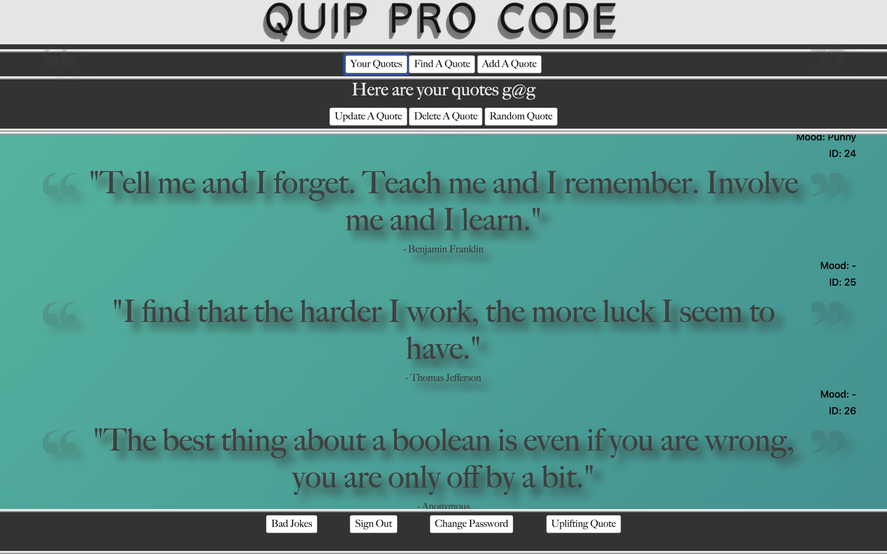
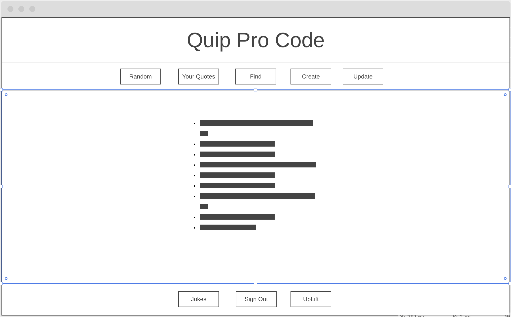

# Quip Pro Code

This is my second project as a developer. My goal was to build my own API and
also build a front end client to connect with my API. I attempted to keep the
front end fairly basic so that I would be able to focus on the small details
involved.

The project itself, is a page designed to help programmers get through their
day by boosting their morale or maybe altering their mood. A user can create a
database of all their favorite quotes and reference them in times of despair.

### Quip Pro Code

## Important Links

[Quip Pro Code API](https://github.com/GMorse19/project-2-api.git)

[Quip Pro Code Deployed Browser](https://gmorse19.github.io/project-2-browser-GMorse/)

[Quip Pro Code Deployed API](https://pacific-harbor-41390.herokuapp.com/)

## Planning

I really wanted to begin this project with more planning than I did on the
first project. Even with the added effort, I feel I could have done even more
planning.

I began my planning by writing out some basic user stories. I now see that I
could have gone a little more in depth with these user stories, but the ones I
did write out helped me tremendously.

Next, I drew up my wireframes to accommodate my users needs. Once again, if my
user stories were more complete, my wireframes would have been a little more
complete. They did serve their purpose and allowed me to begin building my <a href="https://github.com/GMorse19/project-2-api.git">API</a>.
You can read more about that here.

Once my API was up and running, I laid out all of directories for the project
in Atom.

I created a basic layout in my index.html file with all of the features I
would need. I then worked my way through my first API call to make sure I was connected properly. I wanted to make sure I could store and retrieve my resource
as needed.

Once I was successful with my first API call, I began building the rest.

I began with a POST request, followed by a GET, PATCH and DELETE.

Setting up the API calls was a great hurdle to get over. I felt I would be the
rest of my development would be a lot easier. This wasn't necessarily the case.

I moved on to working on the logistics of my page next. This proved to be a
little more challenging than I expected. When to show certain functionality and making sure the layout still made sense was my goal here. It took some time, but
I did finally mananage to come with something acceptable.

For my next challenge I moved on to styling. While I enjoy this process, it is
not one of stron gpoints, yet. I made some strides in my CSS knowledge during
this project, but I spent most of my time testing out features and didn't end up
applying much of what I discovered. In the next version I will give it a shot.

I finsihed the project with a random choice button and cleaned up my code as
best I could.

## Technologies Used

- JavaScript
- jQuery
- Handlebars
- HTML
- CSS
- Ajax

## Wire Frame

#### Home Page

## User Stories

- As a user, I want to sign-up and sign-in.
- As a user, I want to create and delete quotes.
- As a user, I'd like to add a 'mood' to my created quotes.
- As a user, I want to view all of my quotes.
- As a user, I want to update my quotes.
- As a user, I'd like to view all quotes.
- As a user, I'd like to search quotes by their mood.

## Unsolved Problems

I still want to work on signing in on sign-up.

I'd like to add a link to a third party API to draw quotes from.

I'd like to add more searchable options. Currently you can only search by ID.

I'd like to add an option to only update one parameter at a time.

I'd like to add a better field for adding a quote.

I'd like to add a Bad Jokes button for fun.

I would definitely like to achieve more on the styling front. Better button
design, better color scheme, better header and auth fields. Basically, I'd like
to really take a crack at a full makeover for the project.
